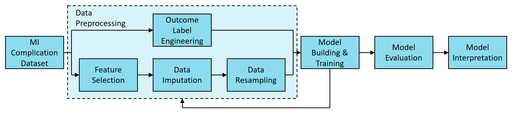
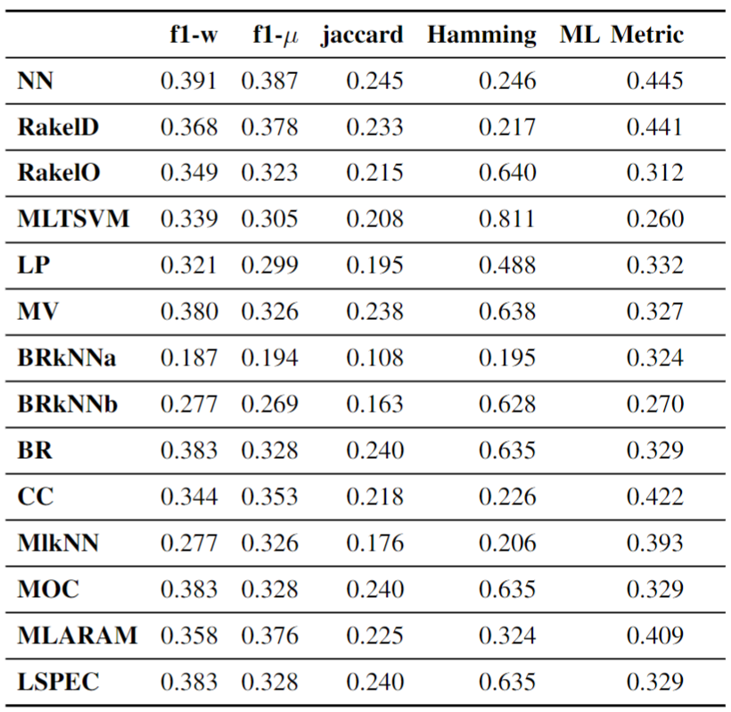
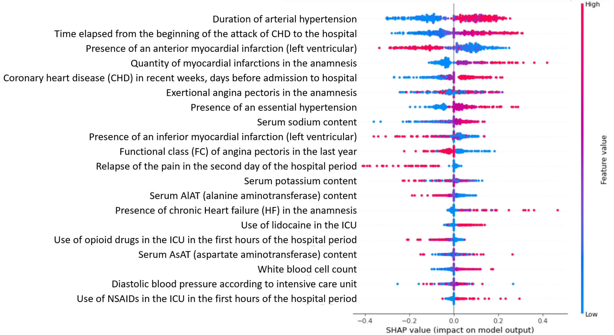
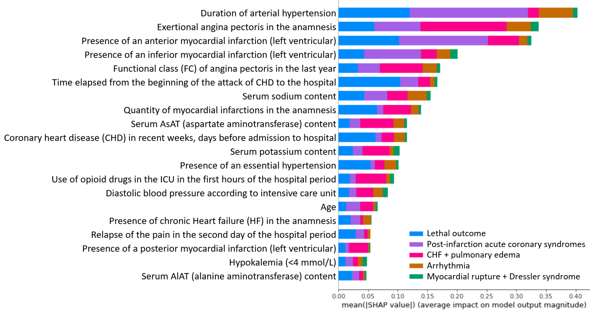

# Multi-label Neural Model for Prediction of Myocardial Infarction Complications with Resampling and Explainability
This repository is the official implementation of Multi-label Neural Model for Prediction of Myocardial Infarction Complications with Resampling and Explainability. The dataset used in this project can be accessed [here](https://github.com/kaiwentw1018/Multilabel-MI-Complications/blob/main/Preprocessing/Myocardial_infarction_complications_Database.csv). 

The figure below shows the pipeline system that summarizes the whole predictive modeling process: 

## Data Processing
The 2 notebooks document how the dataset was processed as delineated in the paper: 
#### [Data_Preprocessing_1](https://github.com/kaiwentw1018/Multilabel-MI-Complications/blob/main/Preprocessing/Data_Preprocessing_1.ipynb) includes the following section: 
* Remove features with significant missingness (>25%)
* Feature selection
#### [Data_Preprocessing_2](https://github.com/kaiwentw1018/Multilabel-MI-Complications/blob/main/Preprocessing/Data_Preprocessing_2.ipynb) includes the following section: 
* Data imputation (with MICE, PMM, Mean/Mode, regression, kNN and evaluated with NRMSE)
* Splitting the dataset into test/train subsets
* Outcome label space reconstruction

## Training
The following multi-label models were trained and the results evaluated:  
* Neural network [(NN)](https://github.com/kaiwentw1018/Multilabel-MI-Complications/blob/main/Training/NN.ipynb) (The trained NN model is saved [here](https://github.com/kaiwentw1018/Multilabel-MI-Complications/tree/main/Training/Saved%20Model_NN))
* Random k-labelsets [(RAKEL)](https://github.com/kaiwentw1018/Multilabel-MI-Complications/blob/main/Training/RAKEL.ipynb): RakelD, RakelO
* Multi-label support vector machines [(MLTSVM)](https://github.com/kaiwentw1018/Multilabel-MI-Complications/blob/main/Training/MLTSVM.ipynb)
* Label powerset [(LP)](https://github.com/kaiwentw1018/Multilabel-MI-Complications/blob/main/Training/LP.ipynb)
* Majority voting [(MV)](https://github.com/kaiwentw1018/Multilabel-MI-Complications/blob/main/Training/MV.ipynb)
* Binary relevance k-nearest neighbor [(BRkNN)](https://github.com/kaiwentw1018/Multilabel-MI-Complications/blob/main/Training/BRkNN.ipynb): BRkNNa, BRkNNb
* Binary relevance [(BR)](https://github.com/kaiwentw1018/Multilabel-MI-Complications/blob/main/Training/BR.ipynb)
* Classifier chains [(CC)](https://github.com/kaiwentw1018/Multilabel-MI-Complications/blob/main/Training/CC.ipynb)
* Multi-label k-Nearest Neighbours [(MlkNN)](https://github.com/kaiwentw1018/Multilabel-MI-Complications/blob/main/Training/MlkNN.ipynb)
* Multi-output classifier [(MOC)](https://github.com/kaiwentw1018/Multilabel-MI-Complications/blob/main/Training/MOC.ipynb)
* Multi-label fuzzy adaptive resonance associative map [(MLARAM)](https://github.com/kaiwentw1018/Multilabel-MI-Complications/blob/main/Training/MLARAM.ipynb)
* Label space partition ensemble classifier [(LSPEC)](https://github.com/kaiwentw1018/Multilabel-MI-Complications/blob/main/Training/LSPEC.ipynb)

## Results
Our models achieve the following performances:

### Shapley Analysis 
Take "lethal outcome" as an example, the beeswarm plot below provides an overview of the impact of the features on the prediction, with each dot representing the Shapley value of every feature for all samples. The pink dots of positive Shapley values indicate that the higher values of the said feature pushes the model to a positive prediction, whereas the those of negative Shapley values push the prediction in the opposite direction. The duration of arterial hypertension, time elapsed from the beginning of the attack of CHD to the hospital, and quantity of myocardial infarctions in the anamnesis were observed to be the most important features that lead to a prediction of death while the presence of an anterior myocardial infarction pushes the model to a negative prediction. 

The figure below shows the average absolute of the Shapley values over the whole testing dataset for all five prediction outcomes. The duration of arterial hypertension, exertional angina pectoris in the anamnesis, and presence of an anterior/inferior infarction were observed to be the most important features for all five outcomes. 

